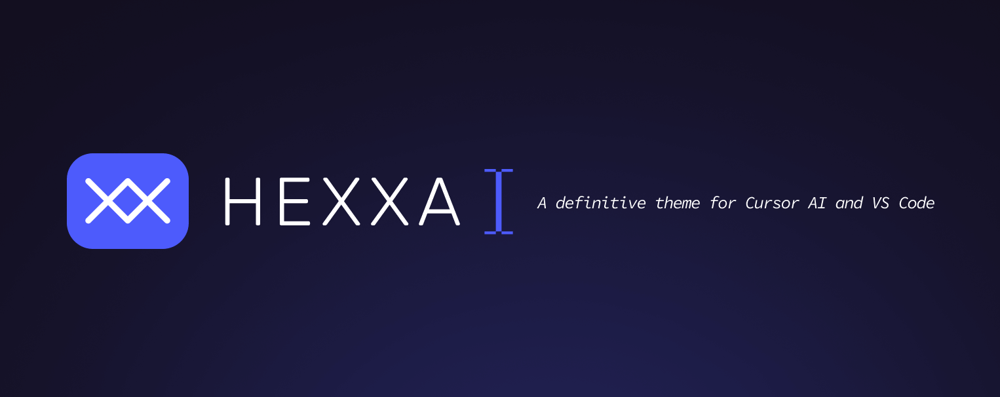
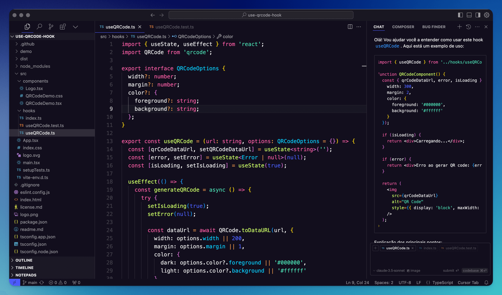

## Preview

It's a preview of the theme from Cursor AI:



## Installation in Cursor AI

#### Using "Extensions" tab:

1. Open **Extensions** sidebar panel in Cursor AI. `View → Extensions`
2. Search for `Hexxa Theme`
3. Click **Install** to install it

#### ... or Using Cursor CLI:

```
cursor --install-extension diogomoretti.hexxa-theme
```

## Installation in VS Code

1. Open **Extensions** sidebar panel in VS Code. `View → Extensions`
2. Search for `Hexxa Theme`
3. Click **Install** to install it
4. Code > Preferences > Color Theme > **Hexxa Theme**

## License

[MIT](./license.md)
